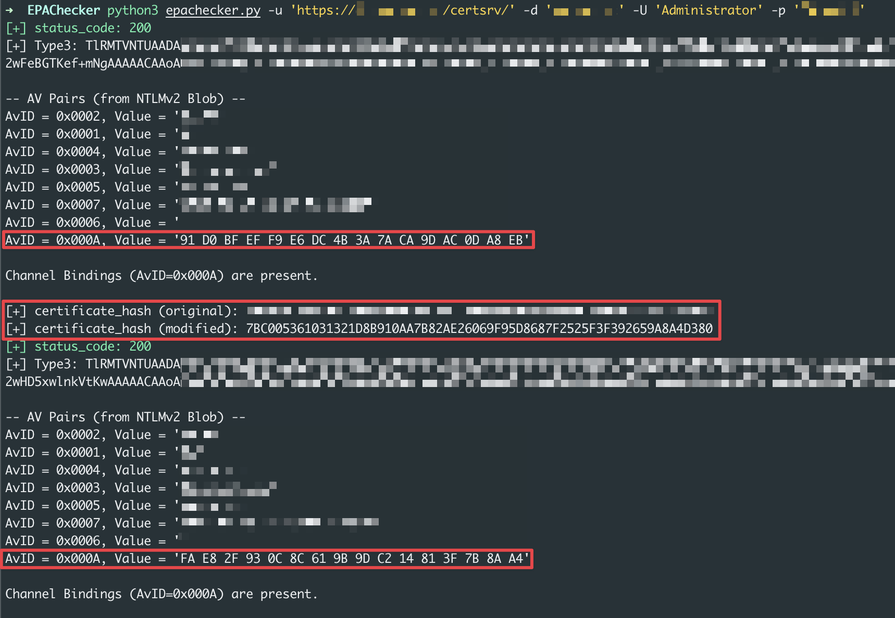
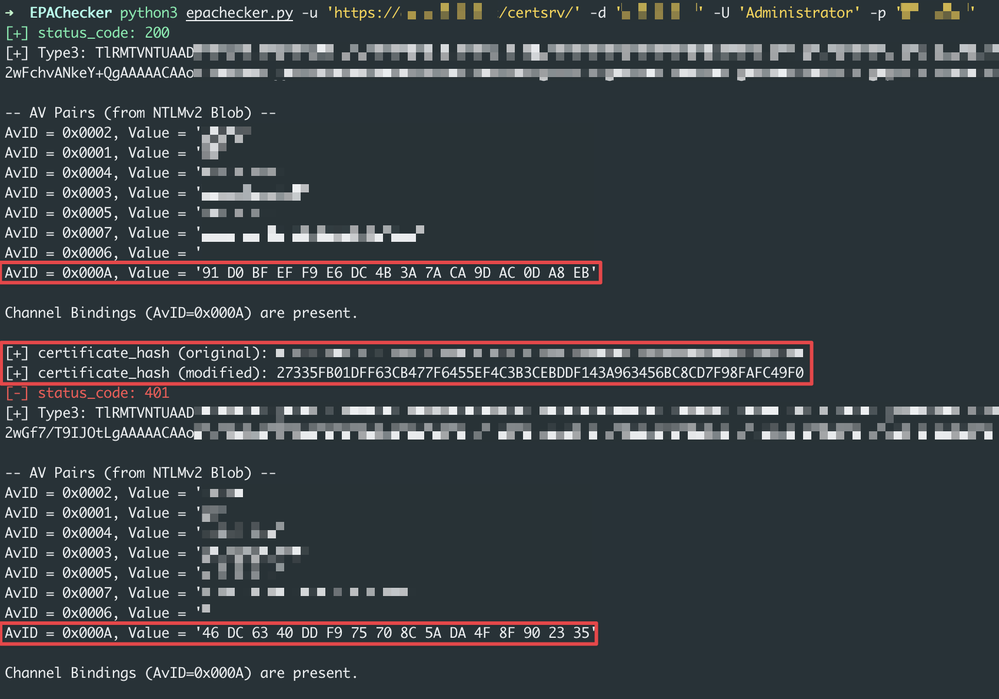
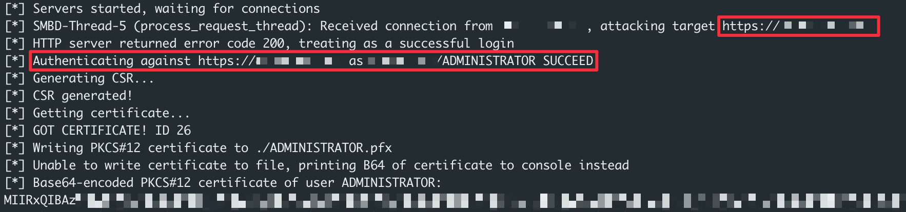

# EPAChecker🛡️
<p align="center">
<a href="https://opensource.org/licenses/MIT"></a>
<a href="https://x.com/kawakatz"></a>
</p>

<p align="center">
  <a href="#usage">Usage</a> •
  <a href="#logic">Logic</a> •
  <a href="#recommendations">Recommendations</a> •
  <a href="#common-misunderstanding">Common misunderstanding</a> •
  <a href="#todo">Todo</a> •
  <a href="#references">References</a>
</p>

EPAChecker can check if EPA is enabled.<br>

# Usage
```sh
$ python3 -m venv venv
$ source venv/bin/activate
$ python3 -m pip install -r requirements.txt
$ python3 epachecker.py -h
usage: epachecker.py [-h] -u URL -d DOMAIN -U USERNAME -p PASSWORD

EPAChecker

options:
  -h, --help            show this help message and exit
  -u URL, --url URL     URL (e.g. https://<ca server>/certsrv/)
  -d DOMAIN, --domain DOMAIN
                        domain
  -U USERNAME, --username USERNAME
                        username
  -p PASSWORD, --password PASSWORD
                        password
$ python3 epachecker.py -u <URL> -d <domain> -U <username> -p <password>
```

## Proxy Compatibility
Due to EPA specifications, EPAChecker cannot be used in conjunction with proxies that decrypt HTTPS communication, such as Burp Suite. This is, in a sense, the intended behavior of EPA, as the certificate information used during authentication would become that of the proxy. However, EPAChecker can be used with SOCKS proxies, so I recommend using it as follows.
```sh
$ export https_proxy=socks5://<socks ip>:<socks port>
$ python3 epachecker.py -u <URL> -d <domain> -U <username> -p <password>
```

# Logic
The approach involves two NTLM authentication attempts and compares their outcomes to determine the status of EPA.

## Overview
The tool conducts two separate authentication attempts:
1. **Standard NTLM Authentication**
2. **Modified Authentication with a Randomized Certificate Hash**

## Step 1: Standard NTLM Authentication
- **Action:**  
  The tool sends a standard NTLM authentication request to the ADCS web interface.
  
- **Expected Outcome:**  
  Under normal circumstances, this authentication should succeed.

- **Failure Considerations:**  
  If the authentication fails, possible reasons include:
  - NTLM authentication being disabled.
  - Incorrect authentication credentials being provided.

- **Purpose:**  
  To ensure that the basic NTLM authentication mechanism is functioning correctly.

## Step 2: Modified Authentication with a Randomized Certificate Hash
- **Action:**  
  The tool performs a second authentication attempt where the certificate hash (used in EPA) is replaced with a random value.

- **Outcome Based on EPA Status:**
  - **EPA Disabled:**  
    The modified authentication will succeed because the server does not validate the certificate hash.
    

  - **EPA Enabled:**  
    The modified authentication will fail, as the server expects the correct certificate hash to be used in the authentication request.
    

# Recommendations
I recommend the following countermeasures against ESC8.
- Disable HTTP (Enable only HTTPS)
- Enable EPA (Extended Protection for Authentication)

# Common misunderstanding
- **Disabling NTLM**  
  In the past, disabling NTLM authentication was said to be one effective countermeasure.<br>
  Of course, it is better to disable NTLM authentication, but it is not a fundamental countermeasure against ESC8.<br>
  Thanks to the recent progress in Kerberos relay research, ESC8 remains a high‑value target.<br>
  - [Relaying Kerberos over DNS using krbrelayx and mitm6](https://dirkjanm.io/relaying-kerberos-over-dns-with-krbrelayx-and-mitm6/)<br>
  - [Relaying Kerberos over SMB using krbrelayx](https://www.synacktiv.com/publications/relaying-kerberos-over-smb-using-krbrelayx)<br>
  - [Abusing multicast poisoning for pre-authenticated Kerberos relay over HTTP with Responder and krbrelayx](https://www.synacktiv.com/publications/abusing-multicast-poisoning-for-pre-authenticated-kerberos-relay-over-http-with)<br>

- **HTTPS without EPA**  
  Some people misunderstand that it is sufficient to simply enable HTTPS without EPA, but that alone is insufficient. See below.<br>
  It is necessary to combine it with EPA.<br>
  

# Todo
Support for additional authentication methods will be added in a future release.

# References
- https://specterops.io/wp-content/uploads/sites/3/2022/06/Certified_Pre-Owned.pdf  
  About ESC8